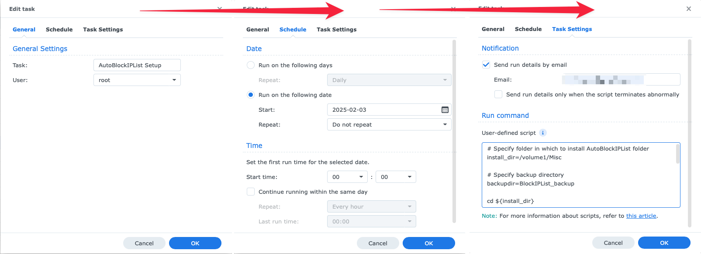

# AutoBlockIPList

> This script allows you to automate the update of the IP block list on the Synology NAS from a list of IP's _(custom user or external list)_.

_This script was tested with Synology DSM 6 (6.2.4) and 7 (7.0, 7.1 and 7.2)_

⚠️  After Synology update, if you encounter any issue, re-run install requirements
---

### Table of contents
#### Usage

    AutoBlockIPList [-h] [-f [IN_FILE ...]] [-u [IN_URL ...]]
                           [-e EXPIRE_IN_DAY] [--remove-expired] [-b BACKUP_TO]
                           [--clear-db] [--dry-run] [-v] [--version]
    
    optional arguments:
    
    -h, --help            show this help message and exit
    
    -f [IN_FILE ...], --in-file [IN_FILE ...]
                        Local list file separated by a space (eg.
                        /home/user/list.txt custom.txt)
                        
    -u [IN_URL ...], --in-url [IN_URL ...]
                        External list url separated by a space (eg
                        https://example.com/list.txt
                        https://example.com/all.txt)
                        
    -e EXPIRE_IN_DAY, --expire-in-day EXPIRE_IN_DAY
                        Expire time in day. Default 0: no expiration
                        
    --remove-expired      Remove expired entry
    
    -b BACKUP_TO, --backup-to BACKUP_TO
                        Folder to store a backup of the database
                        
    --clear-db            Clear ALL deny entry in database before filling
    
    --dry-run             Perform a run without any modifications
    
    -v, --verbose         Increase output verbosity
    
    --version             show program's version number and exit

---

#### Installation

Download [latest release](https://github.com/kichetof/AutoBlockIPList/releases/latest/download/AutoBlockIPList.zip) and unzip contents.

From command line though SSH:

```
wget https://github.com/kichetof/AutoBlockIPList/releases/latest/download/AutoBlockIPList.zip
7z x AutoBlockIPList.zip
```

---

#### Requirements

In DSM, **install package python3**.

Connect to your NAS though SSH and execute following commands:

`sudo python3 -m ensurepip`

Go to AutoBlockIPList folder and run

`sudo python3 -m pip install -r requirements.txt`

---
#### Synology DSM

##### Setup/update user script

Rather than do things over SSH, I prefer to use user-defined scripts in the task scheduler to run the script as root. Here is the script to download, install, and test-run AutoBlockIPList. You can rerun this script to install updated versions should they be released.

Modify the following in the script:

- `install_dir` - The folder in which to install AutoBlockIPList
- `backup_dir` - The folder in which to store backups of the database

```bash
# Specify folder in which to install AutoBlockIPList folder
install_dir=/volume1/Misc

# Specify backup directory
backup_dir=BlockIPList_backup

cd ${install_dir}

# Download latest version of AutoBlockIPList
wget https://github.com/twilsonco/AutoBlockIPList/releases/latest/download/AutoBlockIPList.zip

# Extract to folder, overwriting old version and moving source files to AutoBlockIPList directory
7z x AutoBlockIPList.zip "*/*" -o./AutoBlockIPList -y && rm AutoBlockIPList.zip
cd AutoBlockIPList
mv AutoBlockIPList-*/* ./ && rm -rf AutoBlockIPList-*

# Create and activate virtual environment
python3 -m venv venv
source venv/bin/activate

# Install pip and requirements in virtual environment
python3 -m ensurepip
python3 -m pip install --upgrade pip
python3 -m pip install -r requirements.txt

mkdir -p ../${backup_dir}

# Run script in virtual environment
python3 ./AutoBlockIPList.py --verbose --dry-run \
	--backup-to ../${backup_dir} \
	--expire-in-day 30 \
	--in-url https://iplists.firehol.org/files/firehol_level1.netset \
	https://raw.githubusercontent.com/stamparm/ipsum/master/ipsum.txt \
	https://report.cs.rutgers.edu/DROP/attackers \
	https://lists.blocklist.de/lists/all.txt

# Deactivate virtual environment
deactivate
```

Once you've modified the script, you can copy it into the DSM interface to define a new user-defined script as follows:

- Go to Control Panel -> Task scheduler
  
- Create a new user-defined script to be run at "**root**" user, manually, to install/update AutoBlockIPList
  
- After saving the script, select it in the list of user-defined scripts and click the "Run" button to execute it. 
  - If you selected to receive email notifications, you will receive an email with the output of the script. e.g.
    ```
    IPs parsed from lists to be added: 192924
    Total CIDR networks: 4222
    Total IP in CIDR networks: 21390848
    Total IP invalid: 7
    Total potential IP: 21583772
    Total deny IP currently in your Synology DB: 10949
    Total deny IP now in your Synology DB: 10949 (0 added)
    Dry run mode. No changes were made to the database
    Elapsed time: 821.46 seconds
    ```
  - Otherwise, you can check the intended install directory to see if the script was installed correctly.
  - You should also see your backed up database in the backup directory you specified.

##### Scheduled AutoBlockIPList task

A second script is the one that will be run on a schedule to update the block list. 
Modify it:
- The `install_dir` should match the first script.
- Feel free to add or remove URLs from the `--in-url` list to suit your needs. Be sure to end each line with a backslash `\` except for the last line of the python command.

```bash
# Specify same installation directory as before
install_dir=/volume1/Misc

# Go to AutoBlockIPList directory
cd ${install_dir}/AutoBlockIPList

# Activate virtual environment
source venv/bin/activate

# Run script in virtual environment
python3 ./AutoBlockIPList.py --verbose \
	--remove-expired --expire-in-day 30 \
	--in-url https://iplists.firehol.org/files/firehol_level1.netset \
	https://raw.githubusercontent.com/stamparm/ipsum/master/ipsum.txt \
	https://report.cs.rutgers.edu/DROP/attackers \
	https://lists.blocklist.de/lists/all.txt

# Deactivate virtual environment
deactivate
```

- Setting up the task as "**root**" user
  
- Set the schedule to run the task as often as you like. I recommend running it at least once a day.
- Save the task and you're done!
- You can manually run the task to immediately update the block list, or wait for the scheduled time to run.
  
___

Enjoy :sunglasses:
